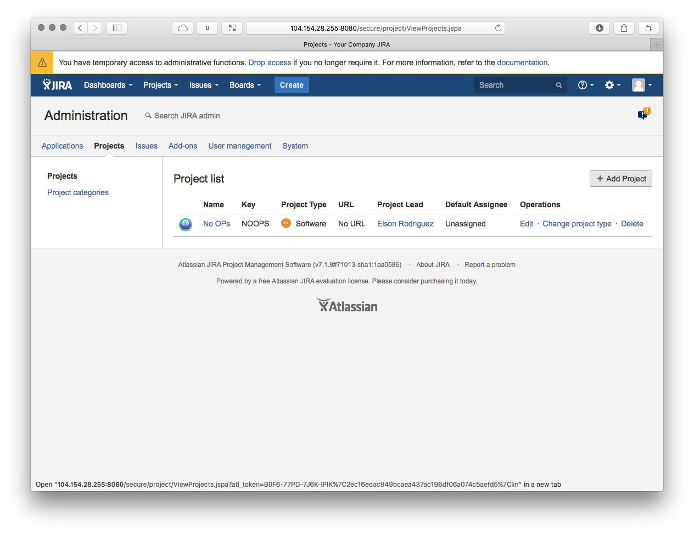
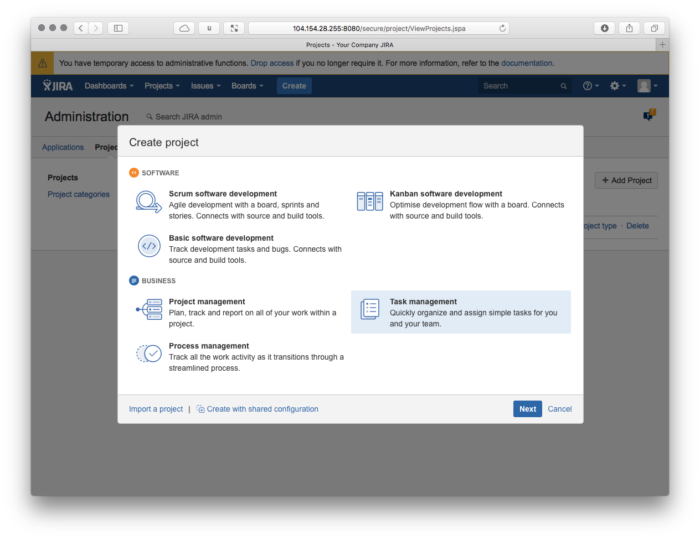
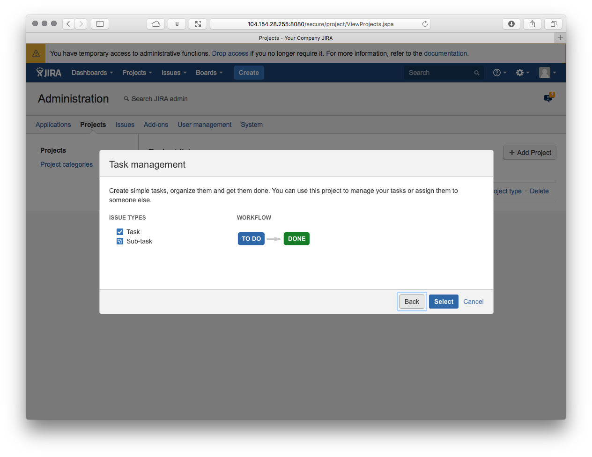
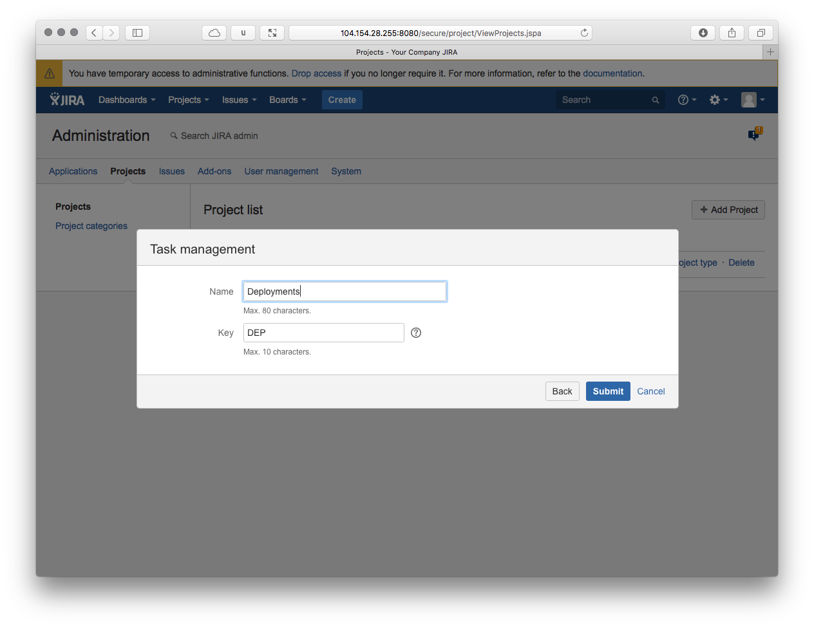

# Automation via Jira
Most common Jira workflows and screens do not lend themselves to the types of simple inputs and outputs that define most automation. This guide will help you create a Jira project that is easily parsable by humans and computers!

## Create a Project

Create a new project From the administration page

Select "Task Management" as the project type and hit next

Click "Select"

Enter your project name, in this example we are creating a Deployment workflow

Click submit

## Create your Issue Type

Go to the Issues Administration page

Click on "Add Issue Type"

Enter the name of the task type, in this case this is a Deployment

Now we must create an Issue type scheme to associate our project with the Deployment task. Create a new Issue Type Scheme called "Automaton". Add "Deployment" as the Issue Type, and "Deployment" as the Default Issue Type"

Associate the scheme with your project:

## Create your Fields

## Create your Screen

## Create your Workflow

